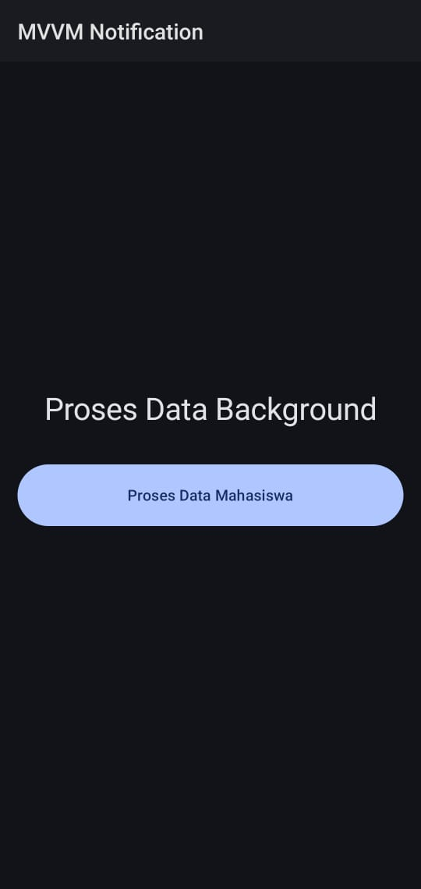
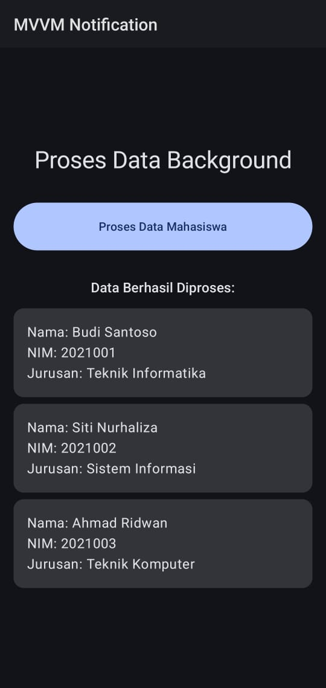
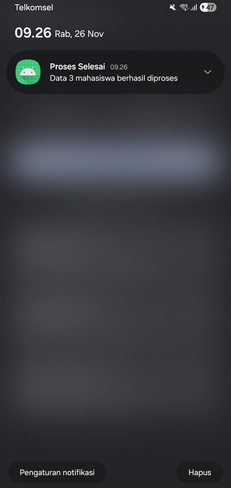

# Aplikasi MVVM dengan Background Process dan Local Notification

## 📱 Deskripsi
Aplikasi Android sederhana yang mendemonstrasikan implementasi:
- **Arsitektur MVVM** (Model-View-ViewModel)
- **Background Processing** menggunakan Kotlin Coroutines
- **Local Notification** di Android
- **Membaca data JSON** dari folder assets
- **Jetpack Compose** untuk UI modern

---

## 👨‍💻 Identitas Mahasiswa 1
- **Nama:** Pradhipta Widya Satria
- **NIM:** 23523129
- **Mata Kuliah:** Pemrograman Aplikasi Bergerak (PAB)
- **Semester:** 5

## 👨‍💻 Identitas Mahasiswa 2
- **Nama:** Rafie Fachrullah Malah
- **NIM:** 23523253
- **Mata Kuliah:** Pemrograman Aplikasi Bergerak (PAB)
- **Semester:** 5

---

## 🎯 Fitur Aplikasi
✅ Arsitektur MVVM yang jelas dan terstruktur  
✅ Background process selama 5 detik menggunakan Coroutines  
✅ Loading indicator saat proses berjalan  
✅ Membaca data 3 mahasiswa dari file JSON  
✅ Menampilkan data mahasiswa di UI  
✅ Notifikasi lokal otomatis muncul setelah proses selesai  
✅ Material Design 3 dengan Jetpack Compose

---

## 🏗️ Arsitektur MVVM

### Model
- **Mahasiswa** (Data Class): Struktur data mahasiswa
- **MahasiswaRepository**: Bertanggung jawab membaca data JSON dari assets

### View
- **MainActivity**: Activity utama dengan Compose UI
- **MainScreen**: Composable function untuk tampilan UI
- **Theme Compose**: Color.kt dan Theme.kt untuk styling

### ViewModel
- **MahasiswaViewModel**: Mengelola UI state dan business logic
- Menggunakan **StateFlow** untuk reactive programming
- Mengkoordinasikan Repository dan NotificationHelper

### Komponen Tambahan
- **NotificationHelper**: Mengelola pembuatan dan tampilan notifikasi lokal

---

## 📊 Flow Aplikasi

```
User menekan tombol
       ↓
ViewModel.processData() dipanggil
       ↓
Loading indicator muncul
       ↓
Background process 5 detik (Coroutines)
       ↓
Repository membaca data JSON
       ↓
Data ditampilkan di UI
       ↓
Notifikasi lokal muncul
```

---

## 📸 Screenshot Aplikasi

### 1. Layar Awal
Tampilan awal aplikasi dengan tombol "Proses Data Mahasiswa"



---

### 2. Proses Loading
Loading indicator muncul selama 5 detik proses background



---

### 3. Data & Notifikasi
Data 3 mahasiswa berhasil ditampilkan dan notifikasi muncul



---

## 🗂️ Struktur Project

```
MVVMNotification/
├── app/
│   ├── src/
│   │   ├── main/
│   │   │   ├── assets/
│   │   │   │   └── mahasiswa.json          # Data JSON 3 mahasiswa
│   │   │   ├── java/com/example/mvvmnotification/
│   │   │   │   ├── ui/theme/
│   │   │   │   │   ├── Color.kt            # Definisi warna
│   │   │   │   │   └── Theme.kt            # Material Theme Compose
│   │   │   │   ├── MainActivity.kt         # Activity utama
│   │   │   │   ├── MahasiswaViewModel.kt   # ViewModel (Logic)
│   │   │   │   ├── MahasiswaRepository.kt  # Repository (Data)
│   │   │   │   └── NotificationHelper.kt   # Helper notifikasi
│   │   │   └── AndroidManifest.xml         # Manifest + permissions
│   │   └── build.gradle.kts                # Dependencies
│   └── build.gradle.kts
├── screenshots/                             # Folder screenshot
│   ├── 1.jpg                                # Screenshot layar awal
│   ├── 2.jpg                                # Screenshot loading
│   └── 3.jpg                                # Screenshot data & notifikasi
└── README.md                                # File ini
```

---

## 📦 Dependencies

```kotlin
// Core Android
implementation("androidx.core:core-ktx:1.13.1")
implementation("androidx.lifecycle:lifecycle-runtime-ktx:2.8.7")
implementation("androidx.activity:activity-compose:1.9.3")

// Jetpack Compose
implementation(platform("androidx.compose:compose-bom:2024.11.00"))
implementation("androidx.compose.ui:ui")
implementation("androidx.compose.material3:material3")

// ViewModel & Coroutines
implementation("androidx.lifecycle:lifecycle-viewmodel-compose:2.8.7")
implementation("org.jetbrains.kotlinx:kotlinx-coroutines-android:1.9.0")
```

---

## 🔧 Teknologi yang Digunakan

| Teknologi | Versi | Kegunaan |
|-----------|-------|----------|
| Kotlin | 2.0+ | Bahasa pemrograman utama |
| Jetpack Compose | BOM 2024.11.00 | Modern UI toolkit |
| Coroutines | 1.9.0 | Asynchronous programming |
| StateFlow | - | Reactive state management |
| Material Design 3 | - | Design system |
| Android Notification API | - | Local notifications |

---

## 📝 Data JSON (mahasiswa.json)

```json
[
  {
    "nama": "Budi Santoso",
    "nim": "2021001",
    "jurusan": "Teknik Informatika"
  },
  {
    "nama": "Siti Nurhaliza",
    "nim": "2021002",
    "jurusan": "Sistem Informasi"
  },
  {
    "nama": "Ahmad Ridwan",
    "nim": "2021003",
    "jurusan": "Teknik Komputer"
  }
]
```

---

## 🚀 Cara Menjalankan

1. **Clone atau download project ini**
2. **Buka dengan Android Studio**
3. **Sync Gradle** (tunggu hingga selesai)
4. **Setup Emulator** atau hubungkan device fisik
5. **Klik tombol Run** (segitiga hijau)
6. **Izinkan permission notifikasi** saat muncul popup
7. **Tekan tombol** "Proses Data Mahasiswa"
8. **Tunggu 5 detik** (loading)
9. **Lihat hasilnya:**
    - Data mahasiswa muncul di layar
    - Notifikasi muncul di notification bar

---

## 🎓 Penjelasan Kode Penting

### 1. Background Process dengan Coroutines

```kotlin
fun processData() {
    viewModelScope.launch {
        _uiState.value = _uiState.value.copy(isLoading = true)
        
        // Background process 5 detik
        delay(5000)
        
        // Load data
        val mahasiswaList = repository.loadMahasiswaData()
        
        _uiState.value = _uiState.value.copy(
            mahasiswaList = mahasiswaList,
            isLoading = false
        )
        
        // Show notification
        notificationHelper.showNotification(
            title = "Proses Selesai",
            message = "Data ${mahasiswaList.size} mahasiswa berhasil diproses"
        )
    }
}
```

**Penjelasan:**
- `viewModelScope.launch` → Menjalankan coroutine di scope ViewModel
- `delay(5000)` → Simulasi proses background selama 5 detik
- `StateFlow` → Digunakan untuk reactive UI updates

---

### 2. Membaca JSON dari Assets

```kotlin
fun loadMahasiswaData(): List<Mahasiswa> {
    return try {
        val jsonString = context.assets.open("mahasiswa.json")
            .bufferedReader()
            .use { it.readText() }
        
        val jsonArray = JSONArray(jsonString)
        val mahasiswaList = mutableListOf<Mahasiswa>()
        
        for (i in 0 until jsonArray.length()) {
            val jsonObject = jsonArray.getJSONObject(i)
            mahasiswaList.add(
                Mahasiswa(
                    nama = jsonObject.getString("nama"),
                    nim = jsonObject.getString("nim"),
                    jurusan = jsonObject.getString("jurusan")
                )
            )
        }
        
        mahasiswaList
    } catch (e: Exception) {
        e.printStackTrace()
        emptyList()
    }
}
```

**Penjelasan:**
- `context.assets.open()` → Membuka file dari folder assets
- `JSONArray()` → Parsing JSON array
- Error handling dengan try-catch untuk keamanan

---

### 3. StateFlow untuk Reactive UI

```kotlin
// Di ViewModel
private val _uiState = MutableStateFlow(MahasiswaUiState())
val uiState: StateFlow<MahasiswaUiState> = _uiState.asStateFlow()

// Di Composable
val uiState by viewModel.uiState.collectAsState()

if (uiState.isLoading) {
    CircularProgressIndicator()
} else {
    Button(onClick = { viewModel.processData() }) {
        Text("Proses Data Mahasiswa")
    }
}
```

**Penjelasan:**
- `StateFlow` → Observable state holder untuk Compose
- `collectAsState()` → Mengubah Flow menjadi Compose State
- UI otomatis update saat state berubah

---

### 4. Local Notification

```kotlin
fun showNotification(title: String, message: String) {
    val builder = NotificationCompat.Builder(context, CHANNEL_ID)
        .setSmallIcon(android.R.drawable.ic_dialog_info)
        .setContentTitle(title)
        .setContentText(message)
        .setPriority(NotificationCompat.PRIORITY_DEFAULT)
        .setAutoCancel(true)
    
    NotificationManagerCompat.from(context).notify(NOTIFICATION_ID, builder.build())
}
```

**Penjelasan:**
- `NotificationChannel` → Required untuk Android 8.0+
- `NotificationCompat` → Backward compatibility
- `setAutoCancel(true)` → Notifikasi hilang saat di-tap

---

## 📱 Minimum Requirements

- **Android Studio:** Arctic Fox atau lebih baru
- **Minimum SDK:** API 26 (Android 8.0 Oreo)
- **Target SDK:** API 34 (Android 14)
- **Java Version:** JDK 17
- **Gradle:** 8.0+
- **Kotlin:** 2.0+

---

## 🔍 Penjelasan Arsitektur MVVM

### Mengapa MVVM?

1. **Separation of Concerns**: Setiap layer punya tanggung jawab spesifik
2. **Testability**: Mudah untuk unit testing
3. **Maintainability**: Kode lebih mudah di-maintain
4. **Scalability**: Mudah untuk dikembangkan

### Alur Data di MVVM

```
View (MainActivity/Composable)
    ↕
ViewModel (MahasiswaViewModel)
    ↕
Model (Repository + Data Class)
```

**View** → Hanya menampilkan UI dan menangkap user input  
**ViewModel** → Mengelola UI state dan business logic  
**Model** → Mengelola data (dari JSON, database, API, dll)

---

## 🐛 Troubleshooting

### Notifikasi tidak muncul?
**Solusi:**
1. Pastikan sudah izinkan permission notifikasi
2. Cek Settings → Apps → MVVM Notification → Notifications → ON

### Error saat build?
**Solusi:**
1. File → Invalidate Caches → Invalidate and Restart
2. Build → Clean Project
3. Build → Rebuild Project

### Data tidak muncul?
**Solusi:**
1. Pastikan file `mahasiswa.json` ada di folder `assets`
2. Cek Logcat untuk error message
3. Pastikan format JSON benar

---

## 📚 Referensi

- [Android Developers - MVVM Architecture](https://developer.android.com/topic/architecture)
- [Kotlin Coroutines Guide](https://kotlinlang.org/docs/coroutines-guide.html)
- [Jetpack Compose Documentation](https://developer.android.com/jetpack/compose)
- [Android Notifications](https://developer.android.com/develop/ui/views/notifications)

---


## 📄 Lisensi

Project ini dibuat untuk keperluan tugas mata kuliah Pemrograman Aplikasi Bergerak.

---

**Dibuat dengan menggunakan Kotlin & Jetpack Compose**

*Last Updated: 26 November 2025*
